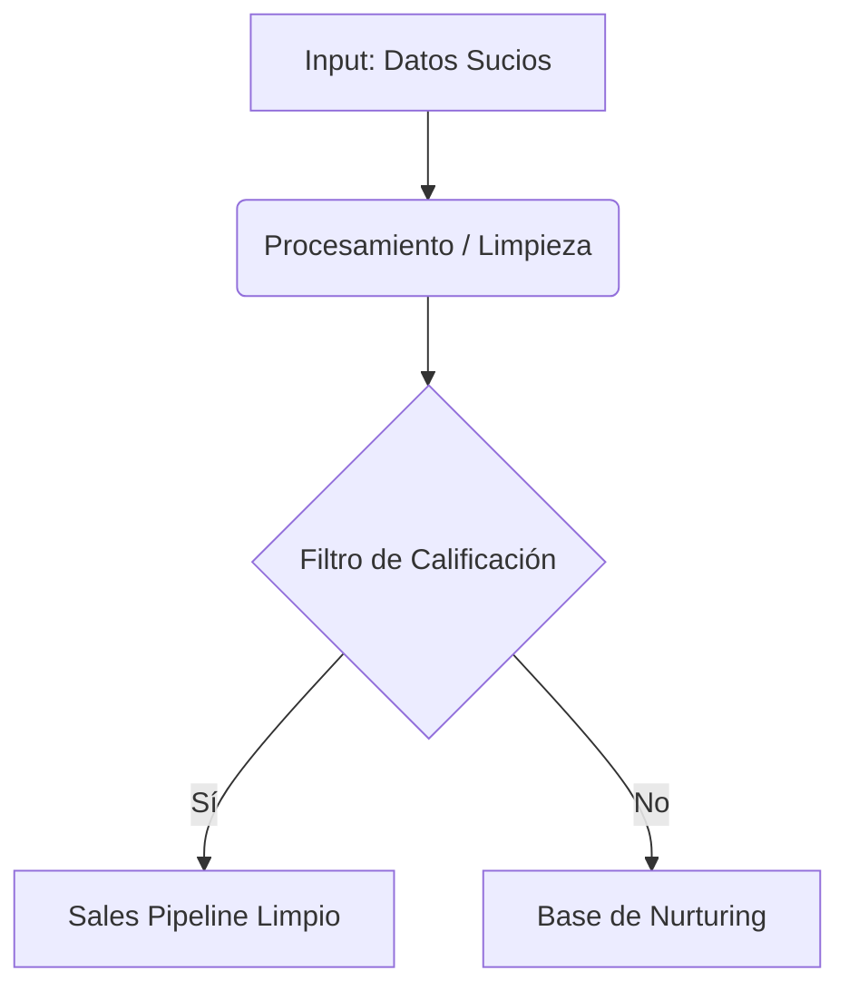

# Título del Artículo (H1 idéntico al frontmatter)

> **Resumen Ejecutivo:** Una o dos oraciones que resuman el dolor de negocio que soluciona este post. Orientado a directores comerciales, VP de ventas y CEOs.

---

## 1. El Contexto y el Dolor de Negocio (The Trench Issue)
Define el problema real identificado en consultorías. No uses rodeos teóricos. Describe la fricción operativa actual y los costos asociados.

- **Síntoma:** "Los vendedores reportan que hacen seguimiento a 100 leads diarios..."
- **Falta de higiene de datos:** "El Excel miente porque..."

*Consejo editorial:* Evita términos de la lista negra de bajo valor como "definición", "qué es" o "gratis".

---

## 2. Deconstrucción de Ingeniería (Engineer's Breakdown)
Aquí explicas la lógica del sistema o el playbook paso a paso. Puedes usar código, tablas, fórmulas o diagramas Mermaid.

### El Paso a Paso Táctico
1. **Paso 1:** Configurar la conexión.
2. **Paso 2:** Automatizar el filtro.

---

## 3. Impacto Financiero y Retorno de Inversión (ROI)
Todo sistema técnico debe vincularse al negocio. Explica cómo esta táctica reduce el tiempo del ciclo de ventas, aumenta el margen o incrementa la tasa de cierre.

| Métrica Anterior | Con el Nuevo Sistema | Impacto en Margen |
| :--------------- | :------------------- | :---------------- |
| 45 días          | 18 días              | +12% Net Revenue  |

---

## 4. Conclusión e Ingeniería de Implementación
Resumen pragmático de cómo empezar a aplicar este playbook hoy mismo.

### 🚀 Siguiente Paso del AI Sales Engine (B2B Call to Action)
Si identificas que tu empresa sufre este estancamiento en el pipeline, [agenda una sesión de viabilidad técnica de 15 minutos](#contacto) para evaluar el diseño de tu motor de ventas.
